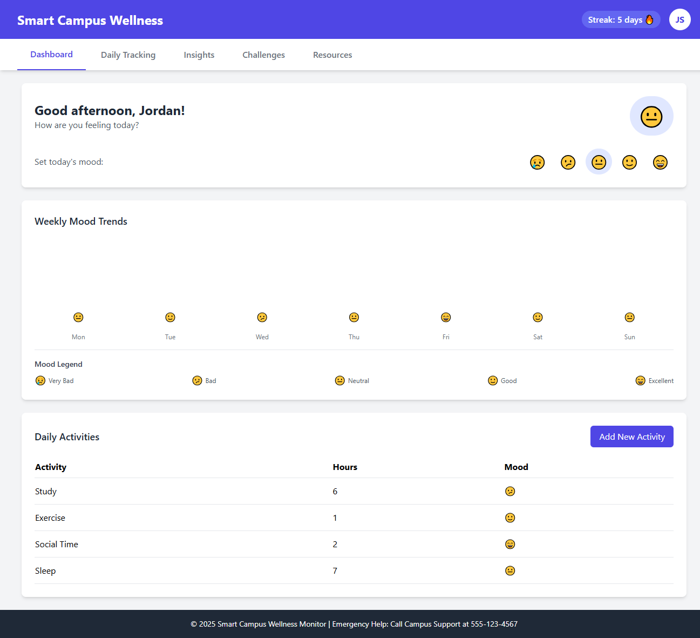

# 🌿 Wellsy – Because Mental Health Deserves a UI Too 🧠💻

> *Built for students. Loved by serotonin. Backed by JavaScript.*

---

## 👋 What is Wellsy?

**Wellsy** is your digital wellness sidekick for campus life.  
It’s a web app where students can **track moods, log habits, reflect, de-stress, and actually breathe** — all from a clean, no-judgment zone.  

From late-night grinds to early morning existential crises, Wellsy is here to help you manage it all without burning out your brain or your browser.

> Think of it like a habit tracker + therapy dog + mini-game arcade. But online. And coded with love.

---

## 🔧 Tech Stack (a.k.a. What’s cooking under the hood)

**Frontend:**
- ⚛️ **React.js** – Dynamic user interfaces  
- ⚡ **Next.js** – Fast routing & server-side goodness  
- 🎨 **Tailwind CSS** – Styling but make it ✨aesthetic✨  
- 📡 **Axios** – Smooth API calls, no drama

**Backend:**
- 🧠 **Node.js** – JavaScript everywhere  
- 🚀 **Express.js** – Makes routing a breeze  
- 🛡️ **JWT Auth** – Secure login/logout, no cap

**Database:**
- 🍃 **MongoDB** – Stores all your wellness data safely

---

## 🌟 Features That Slap

- **📊 Wellness Dashboard** – See how you're *actually* doing


- **😴 Daily Tracking** – Mood, sleep, activity, stress (the full vibe check)


- **📈 Data Insights** – Visualize your progress like a boss


- **📚 Resource Center** – Campus support & emergency info in one click


- **🔐 Secure Auth** – You, and only you, get access to your data

---

## 🧪 Try It Yourself

```bash
# 1. Clone the repo
git clone https://github.com/your-username/wellsy.git

# 2. Navigate inside
cd wellsy

# 3. Install everything
npm install

# 4. Start the dev server
npm run dev
```
## 👨‍💻 Made By

**Ann Maria Jaison** – Developer & mental health ally  
Let’s connect and talk about code, wellness, or memes:

- 📧 annkochu1234@gmail.com
- 💼 [LinkedIn](https://www.linkedin.com/in/annmariajaison/)  

---

> _"If your brain had a dashboard, this would be it." – Wellsy 💚_
